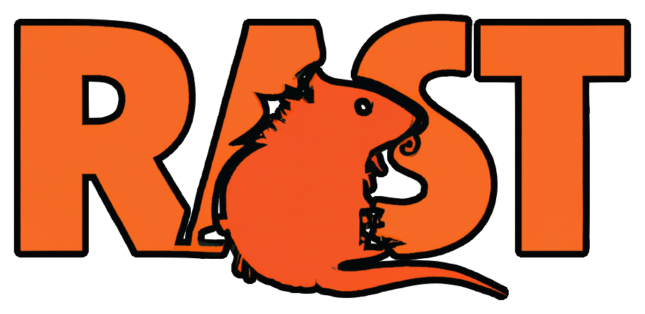

## Stopped working on it for now but planning on going back at some point.

# Rast

A Remote Administration Tool (RAT) and Command and Control (C2) server in Rust!
Blazingly fast by default 🚀 (unless it isn't), fully asynchronous (unless it
isn't), and hopefully working (unless it isn't)!
